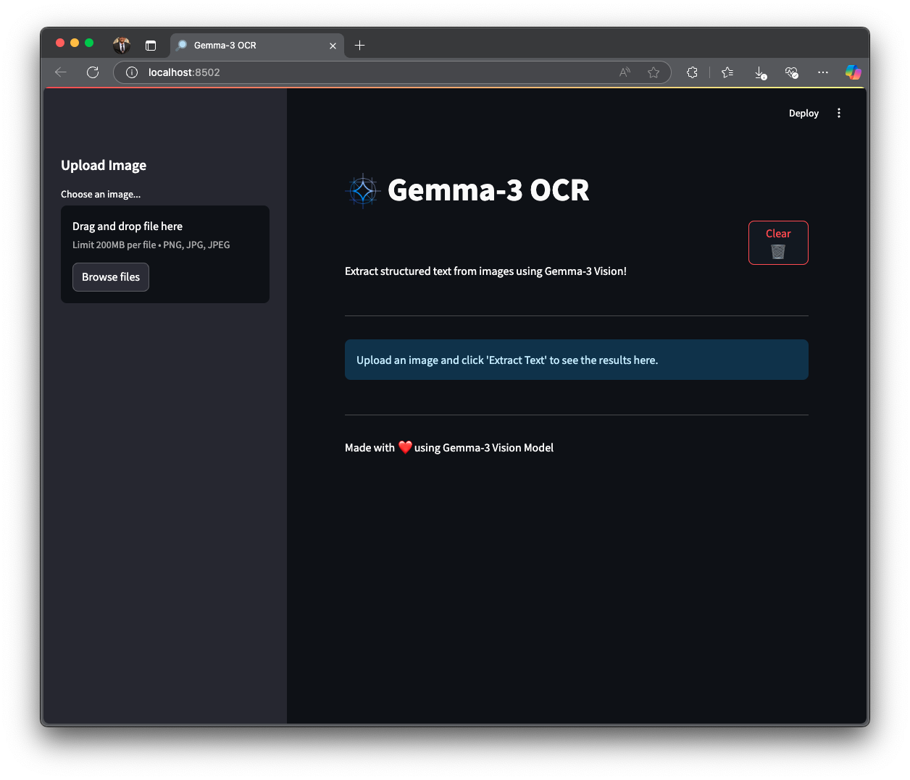
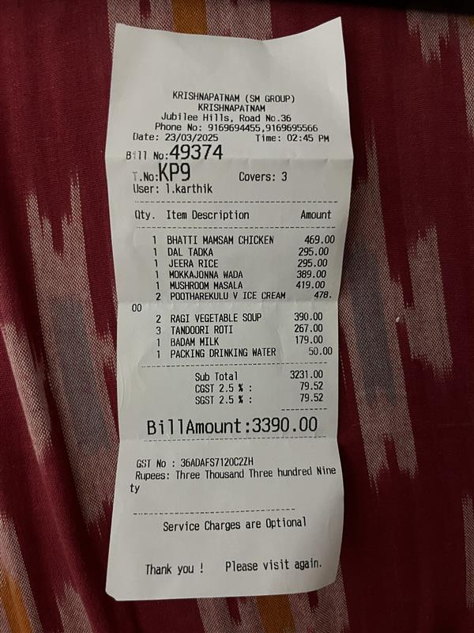
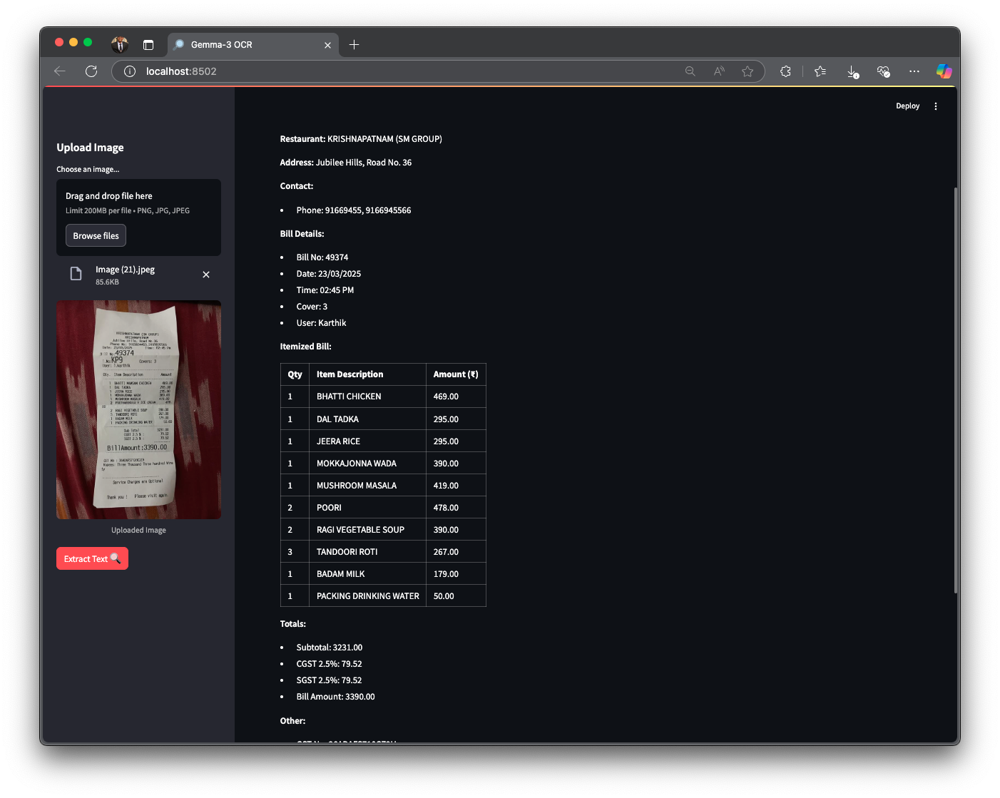

# 🚀 Gemma-3 OCR App  

This project leverages **Gemma-3 Vision** capabilities and **Streamlit** to create a fully **local** computer vision app that performs **OCR (Optical Character Recognition)** and extracts structured text from images.  

---

## 📥 Installation and Setup  

### 1️⃣ **Setup Ollama**  
First, install **Ollama** and pull the **Gemma-3 Vision** model:  

```bash
# Install Ollama on Linux  
curl -fsSL https://ollama.com/install.sh | sh

# Pull the Gemma-3 vision model  
ollama run gemma3:12b
```

### 2️⃣ **Install Dependencies**  
Ensure you have **Python 3.11 or later** installed, then install the required packages:  

```bash
pip install streamlit ollama pillow
```

### 3️⃣ **Launch the Streamlit App**  
Once everything is set up, run the following command to start the application:  

```bash
streamlit run ocr_gemma3.py
```

---

## 🖥️ Application Interface  
Here's what the application looks like:  



---

## 📌 Sample Input  
I uploaded this sample image of a **restaurant bill** for OCR processing:  



---

## ✅ Output Result  
Below is the extracted and structured text result:  



---

## 🛠 Features  
- ✔ Runs **completely locally** (no API required)  
- ✔ Uses **Gemma-3 Vision** for OCR and structured text extraction  
- ✔ Simple and interactive **Streamlit UI**  
- ✔ **Fast processing** and easy to use  

---

## 📝 License  
This project is open-source and available under the **GNU General Public License**.

---

## 🤝 Contributing  
If you’d like to contribute, feel free to fork the repository, create a new branch, and submit a pull request!  

---

### ⭐ If you find this project useful, consider **starring** the repository on GitHub!  
